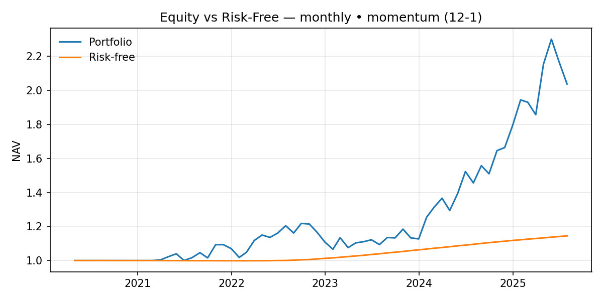
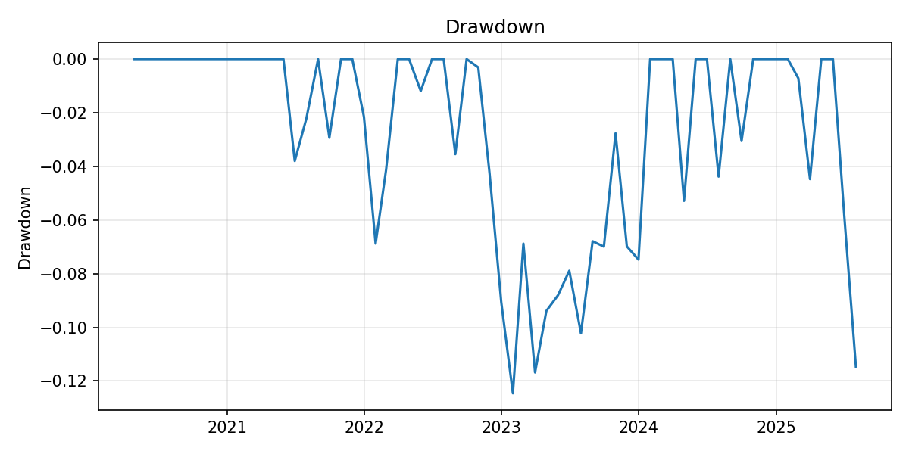
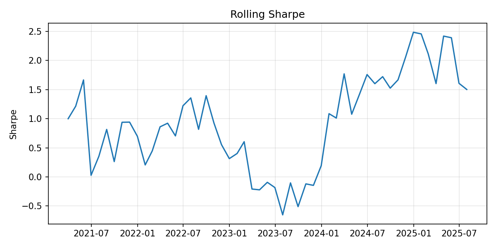
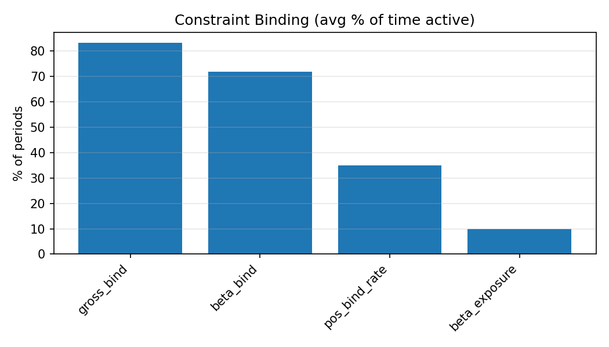
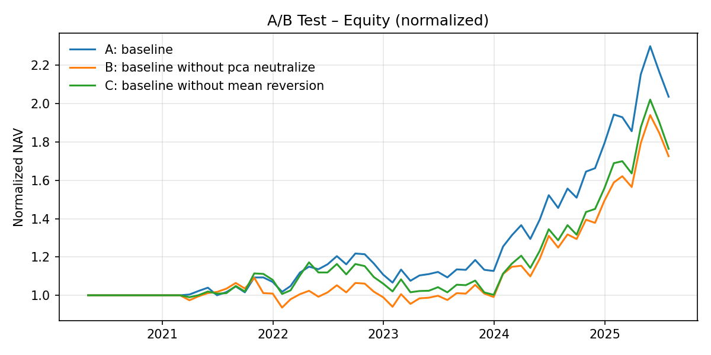
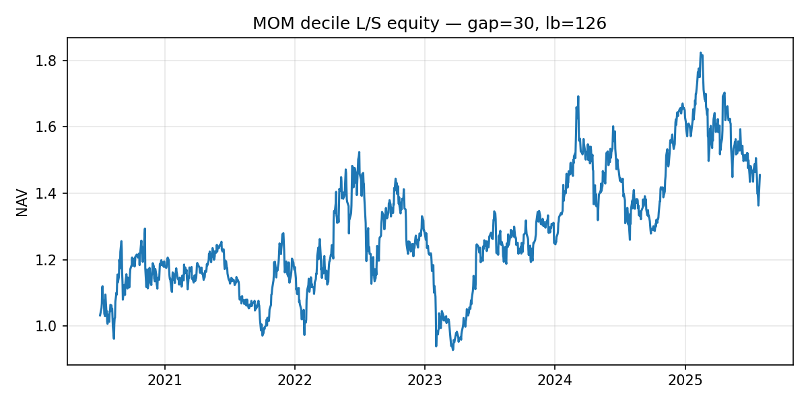

# qstrat
Cross-sectional equity research and portfolio backtesting pipeline in Python—build alpha signals (momentum/mean-reversion), estimate risk (sample/EWMA/Ledoit-Wolf), construct portfolios via cvxpy mean–variance with neutrality/cost constraints, and run walk-forward backtests with PM-style diagnostics.

## Contents
1. Key features
2. Data and sources
3. Results at a glance
4. Configuration reference
5. Run the main workflows
6. Run artifacts & reproducibility
7. Extending the repo
8. Troubleshooting
9. Performance notes
10. Roadmap (brief)
11. Disclaimer
12. License
13. Citation
14. Contact / acknowledgements

## 1. Key features
**End-to-end research pipeline:** Data → Signals → Risk model → Optimizer → Backtest → Reports.  

### Signals (selected via 'MODE' in `projects/alpha_run/config.py`)  
`momentum` — 12–1 with a 1-month gap.  
`mean_reversion` — cross-sectional mean-reversion on market-residual returns.  
`combo` — weighted blend of momentum and mean-reversion.  
`gaussian_process` — Gaussian Process–style cross-sectional regression via kernel methods; includes a Nyström approximation path for scalability.  

`overlay` optional mean-reversion overlay applied on top of any base signal, with a configurable weight to nudge exposures toward a contrarian tilt without replacing the base alpha.  
<br>

### Risk models 
sample covariance; EWMA covariance (configurable λ); Ledoit–Wolf shrinkage; PSD-repair guards.  
<br>

## Portfolio construction (cvxpy mean–variance)

The portfolio at each rebalance is found by solving a **mean–variance program**:

$$
\max_{w \in \mathbb{R}^N} \; \mu^\top w \;-\; \gamma \, w^\top \Sigma w
$$

where  

- $w \in \mathbb{R}^N$ = portfolio weights ($w_i$ = fraction of capital in asset $i$; positive = long, negative = short)  
- $\mu$ = expected return vector (signal)  
- $\Sigma$ = return covariance matrix (estimated on training window)  
- $\gamma$ = risk-aversion parameter  

### Constraint definitions

**Gross exposure cap**

$$
\sum_{i=1}^N |w_i| \;\le\; G
$$

**Market-beta limit**

$$
|\beta^\top w| \;\le\; \beta_{\max}
$$

**Per-name bounds**

$$
l_i \;\le\; w_i \;\le\; u_i \quad \text{for all } i
$$

**Sector neutrality**

$$
S w = \mathbf{0}
$$

**PCA-factor neutrality (risk-model derived)**

On each training window we decompose the return covariance  
$\Sigma_t = V_t \Lambda_t V_t^\top$ and take the top $k$ eigenvectors $V_{t,k}$.  
Neutrality removes exposure to these covariance-driven factors:

$$
V_{t,k}^\top w = \mathbf{0} \quad \text{(hard)}
$$

or

$$
|V_{t,k}^\top w| \;\le\; \phi \quad \text{(capped)} .
$$

**Turnover / cost gate**

A trade is executed only if expected benefit exceeds modeled transaction costs by a buffer.

---

This setup is implemented in **cvxpy**, with constraints selected according to `config.py` (e.g. `factor_neutral=True`, `gross_limit`, `beta_limit`, `transaction_cost_bps`, etc.).
 
<br>

### Backtesting
walk-forward with rolling train window (e.g., 504 trading days); configurable rebalance (weekly/monthly); market filter/crash protection and risk-off shrink; optional ex-ante vol targeting; compounding returns aligned to the rebalance calendar.  
<br>

### Diagnostics & reporting
annualized return/vol/Sharpe, drawdowns, turnover; plots for equity vs risk-free (BIL), drawdowns, rolling Sharpe/vol, constraint binding, exposures; A/B overlays; decile analyses for signals; artifacts saved under `outputs/` and illustrative figures under `figures/`.  

## 2. Data & sources
### Universe 
Example runs use a fixed universe of 50 U.S. large-cap equities defined in `projects/alpha_run/config.py`. The list is user-editable; replace or extend the tickers to suit your study.  
<br>

### Date range & frequency
Prices are fetched at daily frequency and aggregated to the rebalance schedule (weekly or monthly; examples use monthly). Typical examples span Jan 2020–Jul 2025, but start/end dates are configurable in `projects/alpha_run/config.py`.  
<br>

### Vendor & fields
Data come from Yahoo Finance via `yfinance`, using Adjusted Close (dividends/splits included). Other fields (e.g., volume) are optional and not required for the core pipeline.  
<br>

### Market & risk-free series  
*Market proxy:* `SPY` for residualization, beta estimation, and optional market filters.  
*Risk-free proxy:* `BIL` (1–3M T-Bill ETF) aligned to the portfolio’s rebalance calendar for excess-return metrics and reference plots.
<br>

### Return construction  
*Daily returns:* simple percentage returns from Adjusted Close.  
*Period returns:* daily returns are compounded to the rebalance frequency (e.g., monthly), matching how the optimizer/backtest apply trades and constraints.  
<br>

### Alignment & filtering  
Trading calendars are intersected across all tickers and benchmarks; symbols with insufficient history for the chosen train_window_days are dropped by design (see the “usable” count at runtime).  

Missing observations are not forward-filled for signal estimation.  
<br>

### Sector metadata  
A simple, editable sector map is provided for sector neutrality and attribution.
<br>

### Caveats & biases
*Survivorship bias:* the default fixed universe is not point-in-time; for production studies supply dated constituents (e.g., monthly index membership).  
*Vendor quality:* Yahoo data can include gaps/restatements; the pipeline filters catch most issues, but validate critical names.

## 3. Results at a glance
We report after-cost performance over Jan 2020–Jul 2025 with a monthly rebalance (64 periods).  

**Figure 1** shows cumulative equity vs risk-free investment (`BIL`). We report Net Asset Value (NAV) as the cumulative product of portfolio returns,

$$
\mathrm{NAV}_t=\mathrm{NAV}_{t-1}\,\bigl(1+r_{p,t}\bigr),\qquad \mathrm{NAV}_0=1 .
$$

with $NAV_0$=1, where $r_{p,t}$ is the after-cost portfolio return in period *t*. The equity curve is flat through 2020–early 2021 (warm-up while sufficient history accrues), rises in mid-2021, retraces in late-2021 and late-2022 (leadership rotation and compressed cross-sectional dispersion), accelerates in late 2024–spring 2025, and pulls back in mid-2025.


*Figure 1. Cumulative Net Asset Value (NAV) vs risk-free investment (BIL).*  
<br>

**Figure 2** shows peak-to-trough drawdowns over time. Drawdown at time *t* is

$$
D_t = 1 - \frac{\mathrm{NAV}_t}{\max_{0 \le s \le t}\,\mathrm{NAV}_s}\,.
$$

where *s* indexes all past periods up to *t*. Two episodes dominate the sample: late-2022 → early-2023, reaching about −12.5%, and May–July 2025, about −11.5% by the sample end (July 2025). The first follows a leadership (factor) rotation and compressed cross-sectional dispersion, during which ranks reshuffle and momentum reverses; the second follows a strong run in Q4-2024 → April-2025 and reflects mean-reversion of prior gains. In both cases, risk controls—monthly cadence, turnover/cost gating, and exposure caps (gross and market-beta)—contain tail risk but slow re-risking, extending time to recovery.


*Figure 2. Peak-to-trough drawdowns of the cumulative Net Asset Value.*  
<br>

**Figure 3** shows the 12-month rolling Sharpe ratio of excess returns, where excess return is the portfolio return minus the risk-free return (BIL) on the same month. For each month *t*, the statistic is computed over the previous 12 monthly observations as the average excess return divided by its standard deviation, then annualized by $\sqrt{12}$

$$
\mathrm{Sharpe}^{(12\mathrm{m})}_t
= \frac{\overline{r^{\mathrm{excess}}}_{\,12\mathrm{m}}}
{\sigma^{(12\mathrm{m})}_t}\,\sqrt{12},
\qquad r^{\mathrm{excess}}_t = r_{p,t} - r_{f,t}.
$$

  
*Figure 3. Rolling (12-month) Sharpe ratio of portfolio excess returns.*  
<br>

**Figure 4** shows constraint binding over the backtest. The x-axis lists the recorded metrics (`gross_bind`, `beta_bind`, `pos_bind_rate`, and `beta_exposure`); the y-axis is their average over 64 monthly rebalances. `gross_bind` equals 1 in a month when the gross-exposure cap is reached (i.e., $\sum_i \lvert w_i \rvert = G$); taller bars mean the portfolio often sits at this limit. `beta_bind` equals 1 when the portfolio’s absolute market beta hits its configured cap. `pos_bind_rate` is the fraction of names that touch their per-name bounds in a typical month. `beta_exposure` is the average absolute market beta level $|\beta^\top w|$ (a level, not a frequency). Read together, the bars indicate that the gross cap binds most frequently, with market beta and per-name bounds binding less often.

  
*Figure 4. Binding metrics over monthly rebalances (T = 64).*  
<br>

**Figure 5** shows cumulative NAV for three variants. Baseline, **A**, uses monthly rebalance; `MODE = momentum (12–1)`; PCA-factor neutrality computed from the training-window return-covariance (neutralize exposure to the top *k* PCs, i.e., $V_{t,k}^\top w_t = \mathbf{0}$); and mean-reversion overlay; other settings as in the run’s run_config.json. **B** removes PCA neutrality (everything else unchanged). **C** removes the overlay (pure momentum). The curves track closely in 2020–2022, diverge through 2024–2025 with the baseline maintaining a persistent spread, and compress during the mid-2025 pullback.

 
*Figure 5. Equity curves for three variants: A (baseline: momentum 12–1, PCA neutrality ON, overlay ON), B (no PCA neutrality), C (no overlay).*  
<br>

**Figure 6** shows equity curves for momentum deciles (D1 = lowest momentum … D10 = highest), formed monthly using a 126-day lookback with a 30-day gap and tracked as equal-weighted portfolios. The x-axis is time (month-ends); the y-axis is NAV (each decile compounded from its formation updates). The ordering is near-monotonic, with D10 outperforming D1, and the D10–D1 spread widening notably in 2024–2025—consistent with stronger rank persistence and larger cross-sectional premia in that period; the spread is flatter through 2022–2023, reflecting compressed dispersion.


*Figure 6. Equity curves for momentum deciles (monthly rebalanced; lookback 126, gap 30).*

## 4. Configuration reference
Configuration lives in `projects/alpha_run/config.py`. Key switches and knobs (names match the code):

### Run window & cadence
`start_date`, `end_date` — backtest window (YYYY-MM-DD).  
`rebalance_freq` — `monthly` or `weekly`.  
`train_window_days` — length of rolling training window (e.g., `504`).

### Universe & benchmarks
`tickers` — list of symbols (edit to change universe).  
`market_ticker` — market proxy for residuals/beta (default: `SPY`).  
`riskfree_ticker` — risk-free proxy (default: `BIL`).

### Signals (chosen via MODE)
`MODE` — one of: `momentum`, `mean_reversion`, `combo`, `gaussian_process` (Nyström path available).  
`overlay_weight` — optional mean-reversion overlay applied on top of any base mode (e.g., `0.15`).

Signal-specific knobs (examples): `mom_lookback`, `mom_gap`; MR residualization on market; GP/Nyström kernel and components.

### Risk model
`cov_model` — `sample`, `ewma`, or `ledoit_wolf`.  
`ewma_lambda` — decay for EWMA (if used).  
`psd_guard` — enable/strength of PSD repair.  

### Optimizer (mean–variance)
`risk_aversion` — γ in μᵀw − γ·wᵀΣw.  
`dollar_neutral` / `long_only` — portfolio style.  
`position_bound` — per-name cap (e.g., `0.02`).  
`gross_limit` — ∑|wᵢ| cap (e.g., `1.0`).  
`beta_limit` — |βᵀw| cap (e.g., `0.05`).  
`sector_neutral` — True/False (uses sector map).  
`factor_neutral` — True/False (PCA neutrality from training window).  

Optional: factor/sector caps instead of strict neutrality.

### Costs, turnover & trading gates
`transaction_cost_bps` — round-trip or per-side (per code path).  
`benefit_cost_buffer` — minimum expected benefit vs cost to trade.  
`min_trade_threshold` — do-not-trade band; helps reduce churn.

### Filters & crash control  
Market filter windows/thresholds (fast/slow) and `cooldown` settings.  
Optional risk-off shrink parameters.

### Reproducibility  
Seeds (if exposed in your config) and every run’s snapshot written to `outputs/.../run_config.json` (details in the “Run artifacts & reproducibility” section).

## 5. Run the main workflows
### 5.1) Clone and enter the repo (any OS)

```
git clone https://github.com/ceeskildsen/qstrat.git
cd qstrat
```

### 5.2) Create & activate a virtual environment, then install deps

**Windows (PowerShell)**
```
python -m venv .venv
.\.venv\Scripts\Activate.ps1
pip install -r requirements.txt
```
<br>

**macOS / Linux**
```
python3 -m venv .venv
source .venv/bin/activate
pip install -r requirements.txt
```
<br>

Use py -m ... on Windows if you prefer the launcher; use python3 on macOS/Linux.

### 5.3) Edit settings in `projects/alpha_run/config.py` (universe, dates, `MODE`, constraints, costs).  

### 5.4) Run from the repo root

**End-to-end backtest**
Writes `outputs/alpha_to_portfolio/` (`pnl.csv`, `weights.csv`, `run_config.json`, and figures like `equity_vs_riskfree.png`, `drawdown.png`, `rolling_sharpe.png`, `constraint_binding_summary.png`).
```
python -m projects.alpha_to_portfolio
```

**Post-run diagnostics**  
Reads a saved run and writes a diagnostics folder under outputs/.
```
python -m projects.portfolio_diagnostics
```

**A/B (or A/B/C) comparison overlay**  
Configure variants inside `projects/ab_test.py`. Writes `outputs/ab_test/equity_ab.png` and `summary.csv`.
```
python -m projects.ab_test
```

**Signal labs (momentum / mean-reversion)**  
Writes decile curves and parameter-sweep summaries under outputs/signal_lab_* and mirrors example figures in figures/.
```
python -m projects.signal_lab_mom
python -m projects.signal_lab_mr
```
*Notes:* If you use Conda, `conda create -n qstrat python=3.11 && conda activate qstrat` works too. Always run commands from the repo root so relative paths (e.g., `outputs/`) resolve correctly.

## 6. Run artifacts & reproducibility
**Where outputs land**  
Each run writes to `outputs/<run_name>/` (created automatically). Typical contents:  
`pnl.csv` — period returns aligned to the rebalance calendar.  
`weights.csv` — portfolio weights per rebalance date (columns = tickers).  
`run_config.json` — exact configuration snapshot used for the run.  
Figures — e.g., `equity_vs_riskfree.png`, `drawdown.png`, `rolling_sharpe.png`, `constraint_binding_summary.png`; plus any A/B or signal-lab plots.
<br>

**Reproduce a run (same code & config)**.
1. Check out the same commit you used to produce the results.
2. Create a clean environment and `pip install -r requirements.txt`.
3. Open `outputs/<run_name>/run_config.json` and mirror its settings in `projects/alpha_run/config.py` (universe, dates, `MODE`, constraints, costs, etc.).
4. Run: `python -m projects.alpha_to_portfolio`.
<br>

**Determinism notes**
- Results are after costs and depend on the rebalance calendar and constraints.
- Price data are fetched live from Yahoo via yfinance; restatements or missing bars can shift numbers. For strict reproducibility, cache or vendor-pin data before re-running.
- Optimizer solutions are deterministic given the same inputs and solver; if you change solver or tolerances, tiny differences can occur near binding constraints.

## 7. Extending the repo
### Add a new signal (MODE)
1. Pick a name (e.g., my_signal) and set it in 'projects/alpha_run/config.py'.
2. Implement a function that returns a cross-sectional expected-return vector $𝜇_t$ (indexed by tickers on the rebalance date) using only past data.
3. Register your function in the signal dispatcher so `MODE="my_signal"` routes to it.
4. Return a z-scored series (the pipeline expects a standardized cross-sectional signal so overlay and constraints behave consistently).
```
# conceptual signature
def estimate_mu(returns_window, cfg, market=None) -> pd.Series:
    # compute cross-sectional scores from past data only
    # z-score across names
    return mu_z  # index = tickers on rebalance date
```
<br>

### Add a risk model (covariance estimator)
1. Implement a function that maps a rolling return window to a PSD covariance $Σ_t$ (tickers × tickers).
2. Expose it via 'cov_model' (e.g., 'my_cov') and register in the risk-model dispatcher.
3. Keep shapes/indices aligned to the universe on the rebalance date.
```
# conceptual signature
def estimate_cov(returns_window, cfg) -> pd.DataFrame:
    # sample / EWMA / shrinkage / custom
    # ensure PSD (repair if needed)
    return Sigma_psd  # DataFrame with tickers × tickers
```

### Add a constraint (optimizer)
1. Extend the constraint builder used by the mean–variance problem $max_𝑤$ $𝜇^⊤$ $𝑤$ − 𝛾 $𝑤^⊤$ Σ $𝑤$
2. Use cvxpy primitives that match the existing pattern (indexing by tickers). Examples:
```
# conceptual cvxpy snippets
cons += [cvx.sum(cvx.abs(w)) <= cfg["gross_limit"]]             # gross-exposure cap
cons += [cvx.abs(beta_vec @ w) <= cfg["beta_limit"]]            # market-beta cap
cons += [w <= ub, w >= lb]                                      # per-name bounds
cons += [sector_mat @ w == 0] if cfg["sector_neutral"] else []  # sector neutrality
# factor/PCA neutrality or caps analogous to sector
```

### Add a new project script (CLI entry)
- Copy a minimal runner from `projects/` (e.g., reads config → calls pipeline → writes `outputs/<run>/`).
- Keep all file paths relative to repo root so users can run it after cloning.

### Sanity checks (recommended)
- Run a signal lab (decile monotonicity) to verify the new signal isn’t noise.
- Compare variants with A/B to quantify impact on NAV, Sharpe, max drawdown, and binding frequencies.
- Inspect constraint binding and beta_exposure plots to confirm behavior under risk policy.

## 8. Troubleshooting
### Cannot activate venv (Windows PowerShell)
Run PowerShell as your user (not Admin) and allow scripts for this session:
```
Set-ExecutionPolicy -Scope Process RemoteSigned
.\.venv\Scripts\Activate.ps1
```
`ModuleNotFoundError` when running modules.
Run from the repo root and use `-m`:
```
python -m projects.alpha_to_portfolio
```

### CVXPY/solver errors (infeasible, unbounded, or missing solver)
Install common solvers and retry:
```
pip install osqp scs clarabel
```

If the problem is infeasibility, relax constraints (e.g., increase `gross_limit`, `position_bound`; loosen `beta_limit`; turn off `sector_neutral`/`factor_neutral` temporarily) and re-run to identify the culprit.

### Covariance not PSD / numerical issues
Enable PSD repair and/or EWMA shrinkage in config:
```
cov_model = "ewma"      # or "ledoit_wolf" if available
psd_guard = True
```

### Yahoo data hiccups (empty/missing bars, HTTP errors)
Re-run the command; yfinance occasionally rate-limits. If a symbol is persistently sparse, remove it from `tickers` or start later. Early months may be skipped until `train_window_days` is satisfied.

### Figures don’t render (headless server).
Force a non-GUI backend:
```
# one-off
set MPLBACKEND=Agg   # Windows
export MPLBACKEND=Agg # macOS/Linux
```

### Paths look wrong in outputs
Always run from the repo root so relative paths like `outputs/` and `figures/` resolve. If you move the repo, delete any cached artifacts and re-run.

### Slow runs / memory.
Reduce universe size, use `rebalance_freq="monthly"`, shorten parameter grids in signal labs, or use the Nyström path for Gaussian Process mode.

## 9. Performance notes
- Runtime drivers. Per rebalance, signal computation is $𝑂(𝑁𝑇)$ (names × window), covariance estimation is $𝑂(𝑁^{2}𝑇)$ time / $𝑂(𝑁^2)$ memory, and the mean–variance solve scales with the number of active constraints and assets. Monthly cadence and moderate universes keep runs practical.
- Vectorization. Momentum, mean-reversion residualization, z-scoring, and period compounding are vectorized; avoid introducing Python loops on the cross-section where possible to keep $𝑂(𝑁)$ passes tight.
- Covariance choice. EWMA and Ledoit–Wolf shrinkage tend to be numerically stable for mid-sized $N$; PSD repair is on the critical path only when the estimator produces near-singular matrices.
- Solvers. OSQP/SCS/Clarabel all work; solution time depends on constraint tightness (binding caps slow convergence). Warm starts and looser tolerances speed iteration when you are exploring.
- Gaussian Process mode. Use the Nyström path for larger universes; with $𝑚≪𝑁$ landmarks the regression scales roughly with $𝑂(𝑁𝑚^{2})$ instead of $𝑂(𝑁^{3})$.
- I/O & plotting. Figure generation is usually negligible vs. optimization; the main I/O cost is the initial data fetch (cache your workspace between runs).

## 10. Roadmap (brief)
- Point-in-time data: add dated universe membership (index constituents by month) and optional local cache to remove survivorship bias and vendor drift.
- Signals: expose additional modes (`gaussian_process` with Nyström already present → extend kernels/landmark selection); parameterized overlay; configurable `combo` weights.
- Neutrality & scaling: robust z-scoring options; PCA/factor neutrality with per-factor rescaling so exposures represent comparable risk across PCs.
- Risk model: richer shrinkage choices (Ledoit–Wolf variants), optional EWMA + shrink hybrid, and diagnostics for covariance quality.
- Optimizer: optional turnover budget; soft penalties (L2/L1) as alternatives to hard caps; per-sector caps.
- Reproducibility: deterministic seeds where applicable; data snapshotting utilities.
- Packaging & CI: `pyproject.toml`/wheel, tests for core modules, and minimal CI to run a tiny backtest smoke test.

## 11. Disclaimer
This repository is provided “as is” for research and educational purposes only and does not constitute investment advice or a recommendation to buy or sell any security. Results depend on configuration, data vendor behavior (e.g., Yahoo Finance adjustments/restatements), and market conditions; past performance is not indicative of future results. No warranty of any kind is expressed or implied; you use the software at your own risk and are responsible for compliance with applicable laws and regulations.

## 12. License
See `LICENSE.txt` in the repository root for the full license terms.

## 13. Citation
If this code or results inform your research or evaluations, please cite the repository and (ideally) the commit you ran.
```
@software{qstrat_2025,
  author  = {Carl Emil Aae Eskildsen},
  title   = {qstrat: Cross-sectional equity research and portfolio backtesting pipeline},
  year    = {2025},
  url     = {https://github.com/ceeskildsen/qstrat},
  note    = {Version: <tag or commit>; Accessed: <YYYY-MM-DD>}
}
```

## 14. Contact / acknowledgements
- Issues & discussions: open a GitHub issue for bugs, questions, or feature requests.
- Contributions: pull requests are welcome (tests + small, focused changes preferred).
- Attribution: thanks to open-source packages used here (pandas, numpy, scipy, scikit-learn, cvxpy, matplotlib, yfinance).